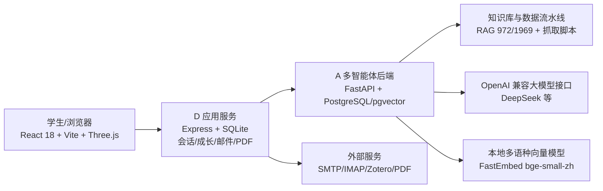

# 科研导师推荐与科研伴学平台 设计文档

## 一、作品概述

本作品面向本科阶段科研起步的真实场景：学生想找导师、做方向调研、读论文、规划任务、复盘进展和联系导师时，信息通常分散在官网、论文平台、课程群和学长经验里，检索成本高，且“哪位导师适合我”很难被一句搜索词回答。本作品将导师知识库、论文证据库与多智能体工作流结合，提供从“研究方向输入”到“可信导师推荐、论文阅读、科研计划、报告复盘、邮件联系”的完整科研助手。

作品最终呈现为可一键启动的全栈 Web 平台。系统以多智能体后端为核心：先理解学生的研究意图，再组织领域研究、导师调研、匹配评分、证据审核和结果撰写等多个智能体角色协同完成检索，而不是用单一 prompt 直接输出答案。

作品已实现并可在本地稳定运行：

- 972 位已核验导师、1969 条证据的中科大导师知识库；
- 导师检索、详情、收藏、对比与 3D 科研星图；
- 多智能体科研检索、科研画像、论文阅读、PDF 合并分析；
- 科研日报/周报/月报、科研计划、邮件草稿与 Zotero 文献同步；
- 用户自己的模型 API 配置、一键环境准备、首次使用自动冒烟验证。

## 二、设计思路

### 2.1 从真实学生路径出发

本科生的科研起点通常不是“检索论文”，而是“我感兴趣什么方向、哪些导师在做”。因此系统以研究兴趣为入口，把科研过程组织为：

找导师 -> 读论文 -> 明确方向 -> 制定任务 -> 执行反馈 -> 生成报告 -> 联系导师

### 2.2 可信优先

导师推荐若产生幻觉，会直接误导学生。因此系统坚持三层约束：

1. 事实来自经过核验的知识库，而不是模型记忆；
2. 模型只负责理解、研究规划、评分说明等可审计任务；
3. 最终结果必须通过证据审核，才允许进入推荐列表。

### 2.3 多智能体协作而不是“单次问答”

“帮我找研究 XX 的导师”需要意图理解、研究边界判断、候选人调研、多维评分、证据校验和结果解释等多个步骤。单一 prompt 无法稳定完成全流程。系统将工作流拆成多个职责独立的智能体角色，由编排器控制阶段、审核和返工，形成可观测、可回退、可审计的 Agent Workflow。

### 2.4 学生可理解、可复盘

前端通过 SSE 展示阶段推进与证据就绪事件，详情页给出匹配依据、证据来源和不确定性说明。不是“黑盒给结论”，而是让用户看到系统为什么推荐这位导师。

## 三、技术架构

### 3.1 总架构



### 3.2 分层说明

| 层 | 技术 | 职责 |
|---|---|---|
| 前端展示 | React 18、TypeScript、Ant Design、Zustand、Vite | 登录、检索、导师详情、3D 云图、PDF、报告、设置 |
| 3D 科研星图 | Three.js | 以 972 节点导师库快照展示科研领域分布与同域关系 |
| D 应用服务 | Express、better-sqlite3、SSE、axios 代理 | 用户数据、成长状态、收藏、邮件、Zotero、PDF 任务、D 到 A 的代理与字段映射 |
| A 智能体后端 | FastAPI、SQLAlchemy、PostgreSQL、pgvector | 导师检索自定义阶段编排器 + 论文/报告 DeepAgents/LangGraph 子代理 |
| 数据流水线 | httpx、离线 TF-IDF、FastEmbed、OpenAlex/S2/DBLP/官网 | 抓取、核验、去重、生成 RAG JSON |
| 模型接入 | OpenAI 兼容 `chat.completions` | 使用 DeepSeek 等模型，可配置 Base URL、Model、API Key |

### 3.3 A 端的两套 Agent 实现

A 端不是只有一种“智能体”。按用途分为两套：

1. 导师检索工作流：代码位于 `backend/mentor_workflow`，使用自定义阶段编排器管理 `input_understanding -> planning -> domain_expert -> mentor_research -> matching -> evidence_review -> result_composer -> completed`。每个阶段是职责明确的 Agent 类，受统一的 `WorkflowState`、事件总线和 `EvidenceReviewAgent` 约束。该系统可在确定性模式下运行，不依赖模型推理；也可开启模型推理模式。
2. 论文阅读、科研报告、科研聊天等工作流：复用 `deepagents` 与 LangGraph 的主 Agent/SubAgent 结构，由主 Agent 路由到论文检索、报告生成等子 Agent，并接入工具事件与 Postgres checkpoint。

因此“多智能体”描述应理解为：导师检索有自定义多角色编排器，论文与科研助手有 DeepAgents 主从智能体，二者共享同一套 AgentRun/事件/审核契约。

导师检索工作流支持双运行模式：

| 模式 | 开关 | 行为 |
|---|---|---|
| 确定性离线模式 | `PAPER_CLAW_MENTOR_WORKFLOW_MODEL_REASONING_ENABLED=false`（默认） | 意图、检索、匹配全部由规则与本地知识库完成，适合演示和无 Key 环境 |
| 模型推理模式 | 开启上述开关并配置 `PAPER_CLAW_CHAT_*` | 领域专家、候选证据分析等阶段调用大模型，同时保留确定性审核兜底 |

### 3.4 数据链路

```text
USTC 官方师资页/教师主页 + OpenAlex/Semantic Scholar/DBLP
    -> 抓取、身份核验、作者归属确认、去重
    -> ustc_mentor_rag.json（972 导师 / 1969 证据）
    -> 语义索引（FastEmbed 本地向量）+ 关键词索引
    -> 多智能体检索 -> 证据审核 -> 匹配结果 -> 前端卡片与详情
```

跨模块统一使用 `candidate_id`（如 `ustc_faculty_26275`）关联知识库、检索结果、详情接口和云图节点，保证同一导师在各功能中身份一致。

### 3.5 D 与 A 的接口契约

D 端不直接读写 A 的数据库，而是通过 HTTP 与 SSE 代理 A 端：

- 导师检索先创建 `AgentRun`/workflow，再轮询事件与状态，最终通过 `GET /result` 获取结果；
- 中间阶段以结构化事件流式返回，前端据此展示 `input_understanding`、`evidence_review` 等阶段；
- D 端在 `mapFinalMentor()` 中把 A 返回的嵌套 `candidate + match` 映射为前端 `Advisor` 契约，避免前端直接依赖 A 内部 schema；
- 详情接口 `GET /api/advisors/:id`、检索结果、RAG `candidate_id` 与云图 `CloudNode.id` 使用同一个导师 ID。

### 3.6 状态持久化与并发

A 端将工作流状态写入 `AgentRun.output_json`，事件写入 `AgentRunEvent`，采用 JSON 内 `state_version` 乐观锁和行锁保证同一 `trace_id` 不会被并发阶段覆盖。该设计使系统支持长时间检索、中断后继续、查询审计轨迹。

## 四、功能模块

### 4.1 用户与科研画像

- 首次登录自动注册，JWT 认证，bcrypt 密码存储；
- 学生维护年级、专业、兴趣、技能与个人简介；
- 科研画像 Agent 基于用户自述和平台审核记录生成能力、方向、缺口与下一步行动，并通过证据引用校验，禁止模型补写事实。

### 4.2 导师智能检索

用户用自然语言描述研究兴趣后，A 端多智能体工作流完成意图理解、领域规划、导师调研、候选匹配、证据审核和结果撰写。D 端以 SSE 将阶段和结果流式返回。

核心工作流阶段：

```text
input_understanding -> planning -> domain_expert -> mentor_research
-> matching -> evidence_review -> result_composer -> completed
```

每个阶段对应明确职责：

| Agent 阶段 | 主要职责 |
|---|---|
| input_understanding | 从自然语言提取研究兴趣、约束与目标，判定信息是否完整 |
| planning | 按目标生成可执行步骤，跳过不必要阶段 |
| domain_expert | 判断领域边界，避免把泛化上位概念无限扩散 |
| mentor_research | 对候选导师做官方资料与论文证据调研 |
| matching | 计算八维匹配分并输出候选与证据 |
| evidence_review | 独立审核证据引用、身份核验、时效与结论一致性 |
| result_composer | 把通过审核的结果整理成学生可读的导师建议 |

按用户目标跳过不必要的阶段：

| 用户目标 | 运行阶段 |
|---|---|
| 找导师 | 全流程 |
| 查看某位导师 | 跳过领域专家与匹配 |
| 对比导师 | 跳过领域专家 |
| 生成联系邮件/追问 | 复用已审核结果，只运行结果撰写 |

输入不足时进入澄清状态，不执行无意义的全流程检索。

### 4.3 导师详情、收藏、对比与星图

- 详情来自真实 RAG，展示职称、院系、研究方向、论文等；
- 收藏与历史记录为每位用户独立保存；
- 3D 星图展示导师科研领域的空间分布与同域关系；
- 前端只展示论文数与匹配度，不使用不可靠的 hIndex。

### 4.4 论文阅读与 PDF 分析

- 上传 PDF 后先抽取正文与页级文本；
- 使用本地多语种向量模型做密集召回，模型不可用时回退到关键词召回；
- 多篇 PDF 可合并分析，Agent 阅读材料后输出研究方向和导师匹配结论，每条结论绑定 PDF 页码证据；
- 最终结果必须通过审核才进入成长状态。

### 4.5 科研计划与进展报告

- 科研计划 Coach 将研究计划拆成可执行、可验收的阶段任务；
- 进展报告 Agent 根据计划、活动、讨论记录生成日报/周报/月报；
- 报告结果经确定性代码渲染，报告邮件按用户自己的 SMTP 配置发送。

### 4.6 联系导师邮件与 Zotero

- 根据导师研究方向和已读论文生成联系邮件草稿；
- SMTP/IMAP 完整收发与待发送队列；
- Zotero 可保存账号并增量同步文献到研究项目。

### 4.7 模型 API 配置

- 启动向导直接收集 Base URL、Model、API Key；
- 网页右上角允许每个登录账号单独覆盖自己的模型配置；
- API Key 加密存储，接口不回传明文。

## 五、多智能体编排与可靠性设计

### 5.1 编排器与状态

编排器维护明确的状态机，阶段事件全部结构化持久化。系统使用行锁与 `state_version` 乐观锁防止并发更新，支持中断后查询、补充输入、继续执行，保证 AgentRun 可观测和可恢复。

### 5.2 证据审核

系统设计了独立审核角色，而不是让检索智能体自行判定：

- 意图是否完整；
- 候选是否存在；
- 证据引用是否闭环；
- 结论是否被字段证据支持；
- 导师是否有研究方向；
- 论文证据是否超过 5 年时效；
- 匹配结论是否与证据一致。

审核不通过时由重试控制器选择返工阶段，而不是直接放大模型输出。

### 5.3 八维匹配分

最终导师评分不是单一余弦相似度，而是综合：

```text
研究方向匹配、方法匹配、应用场景匹配、近期活跃度、
学生背景契合、约束满足、招生意愿、证据完整度
```

分数范围 0-100，保留评分分项与负面因素，前端可解释。

### 5.4 回退与降级

- 导师检索：语义检索 -> 关键词检索 -> 官方源补充；
- 模型模式关闭时，系统以确定性工作流运行，不依赖 API Key；
- PDF/画像等结构化任务开启确定格式控制，模型不可用时使用本地回退；
- 首次使用前通过启动器自动预热向量索引，避免用户承担模型下载等待。

## 六、技术难点与处理

### 6.1 防止导师推荐幻觉

难点：模型可能把“看起来像”的导师写成推荐。方案是知识库先行、证据审核兜底：推荐必须来自已核验导师集合，每条结论必须引用真实证据，未经审核的结果不能写回用户成长状态。

提示词与检索设计上，作品并没有让模型自由生成检索词：

- 查询先解析为 `CORE_TOPIC`、`METHOD`、`APPLICATION_DOMAIN` 等类型化概念；
- 检索策略文件对概念别名、上位词、子领域和必须保留词进行约束，防止模型把“生成式人工智能”扩展成“人工智能”这类泛化错误；
- 导师研究方向字段只接受官方主页（`topics_source=1`）或已核验论文回填（`topics_source=2`）两类来源；
- 系统提示词明确要求模型不得编造导师、论文、招生信息，并要求输出受 Pydantic/JSON Schema 约束。

### 6.2 异构数据源治理

难点：教师主页、OpenAlex、S2、DBLP 数据格式不同，同名不同人。方案：官方目录只用于身份核验；论文通过作者匹配关联；证据按来源、候选、内容哈希去重；导师研究方向只接受官方主页或已核验论文回填。

### 6.3 大模型结构化输出不稳定

难点：DeepSeek 等模型可能先输出 reasoning_content，正文 JSON 为空，或思考内容占满输出额度。方案：结构化任务关闭隐藏思考，保留足够超时预算；用 Pydantic/JSON Schema 做强制校验；解析失败时启动修复流程。

### 6.4 多用户 API 配置与安全

难点：不同用户使用不同模型账号。方案：D 端为每位用户加密保存 API Key，调用 A 端时注入用户自己的模型与 Key；普通用户之间互不可见；平台默认配置仍可一键写入。

当前已覆盖科研对话、科研画像、PDF 合并分析、科研计划、进展报告与论文阅读等 Harness 入口；模型 Key 以加密形式存储，接口不返回明文。

### 6.5 首次使用成本

难点：Hugging Face 在校园网络常不可达，向量模型首次下载会导致用户超时。方案：默认使用可访问镜像，下载失败自动切换；启动阶段预热模型与 972 导师向量索引；一键脚本自动检查环境、建库、迁移并执行新用户冒烟。

### 6.6 响应效率与结果可交付

- 长时间任务先返回任务 ID，后台异步执行，前端轮询，不占用浏览器请求；
- 向量模型和导师向量矩阵在安装阶段预热，避免首用户等待；
- 大模型调用设置超时、重试上限与思考关闭策略，避免 reasoning 内容挤占结构化输出；
- 前端只展示经过审核的结果，超时或降级时明确标记“本地摘要/规则降级”，不伪装成模型结论。

## 七、完成度与验证

- 后端可一键启动，A/D/前端三个服务自动健康检查；
- 提供新用户首次使用自动冒烟：注册、填资料、猜你喜欢、科研画像、双 PDF 合并分析；
- 前端 TypeScript 构建通过，现有 39 项测试全部通过；
- 全部模型功能在真实 DeepSeek 接口下完成端到端验证。

建议演示流程：

1. 启动页面演示“一键启动 + 健康检查”；
2. 新账号注册并填写“我对多模态大模型和智能体感兴趣”；
3. 检索导师，展示阶段事件、匹配分、证据来源与详情；
4. 阅读导师论文/上传两篇 PDF 做合并分析；
5. 生成科研画像与周报，展示邮件发送队列；
6. 在账号菜单展示模型 API 配置与 Zotero 连接。

## 八、可扩展性

- 支持任意 OpenAI 兼容大模型，只需配置 Base URL 和模型名；
- 知识库生成流程可推广到其他高校；
- 多智能体工作流可接入更多校园服务（选课、竞赛、实习、实验室）；
- 成长状态与证据引用模型可复用于科研训练营和研究生科研管理。
